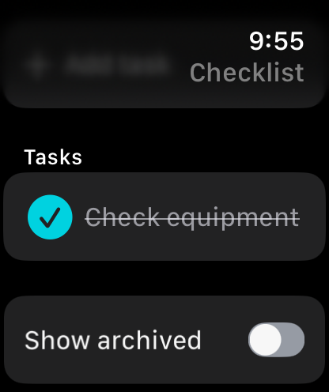
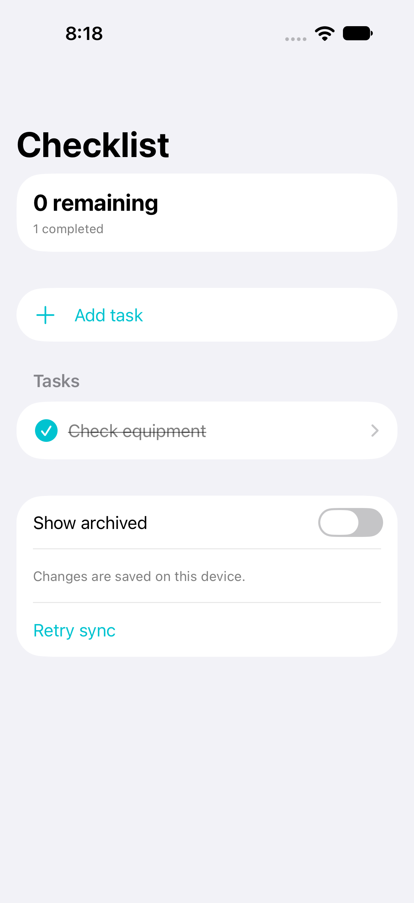

# Wrist Checklist

Offline checklists for Apple Watch and iPhone, with recoverable archiving, paired-device reconciliation, iPhone reminders, and a Watch complication.

## Preview





## Run

Open **Wrist Checklist.xcodeproj** in Xcode 27. Select **Wrist Checklist** for iPhone or **Wrist Checklist Watch** for Apple Watch. Targets are iOS 27 and watchOS 27. Bundle IDs are `com.dd.wristchecklist`, `com.dd.wristchecklist.watchkitapp`, and `com.dd.wristchecklist.watchkitapp.complication`.

For physical devices, select your own development team and register the App Group `group.com.dd.wristchecklist` for the app and complication targets. No signing identity is committed. The main checklist works without App Group access; the complication needs it to read its local snapshot.

## Use

Add a task and optional group using the native keyboard or system dictation. Tap its circle to complete it, or open task details to rename, archive, or restore it. Changes save atomically before appearing in the interface. Archived items remain recoverable and count toward the 200-item workspace limit.

Both devices can work offline. WatchConnectivity sends the latest complete snapshot when the system permits delivery. Edits use logical counters and stable device identifiers to converge without trusting wall-clock time. Concurrent edits to the **same item** use deterministic whole-item conflict resolution; they are not merged field by field. A later explicit edit wins. Old snapshots cannot resurrect an archived task. There is no cloud account or server.

Schedule reminders explicitly in task details on iPhone. Notification permission is requested only then. Completing or archiving an item cancels its pending reminder once the iPhone receives that change. Reminders are delivered on iPhone; system notification mirroring is controlled by your settings. At most the earliest 60 pending reminders are scheduled.

Add **Next task** to a compatible Watch face to see remaining items. The complication opens the app and marks task text as privacy-sensitive. Its refresh timing is controlled by WidgetKit. The **Open Wrist Checklist** App Shortcut opens the app; it does not silently complete tasks.

## Engineering

Swift 6 complete concurrency, an actor-owned atomic store, serialized mutation presentation, bounded sync packets, duplicate/stamp validation, stable JSON snapshots, and durable application-context delivery. Full snapshots preserve offline edits and archive records; the 200-item limit is intentional. No third-party packages.

```sh
swift test
swift test -c release
bash Scripts/test-ui.sh iOS
bash Scripts/test-ui.sh watchOS
```

[Verification](Docs/Verification.md) separates automated checks from paired-device checks. See [privacy](PRIVACY.md) and [contributing](CONTRIBUTING.md). MIT licensed.

Watch quick tasks offer three editable starting points for fast entry. The Watch UI test verifies this path; keyboard and dictation entry require physical-device checks.
